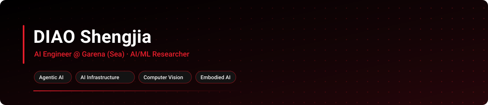
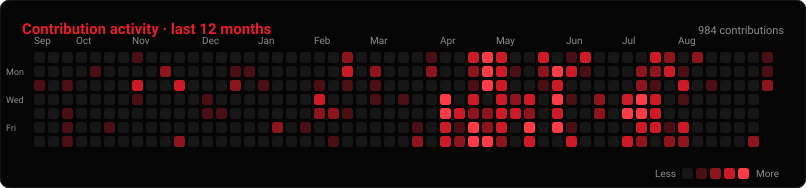
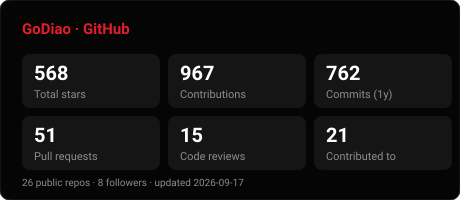
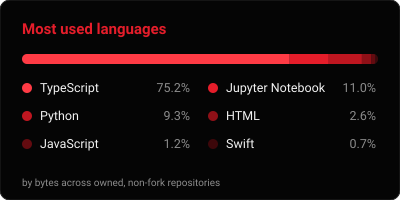

 

  

<code>Agentic AI</code>
<code>AI Infrastructure</code>
<code>Computer Vision</code>
<code>Embodied Intelligence</code>
<code>Singapore</code>

## About

AI Engineer at **Garena (Sea)**, working on agentic AI and AI infrastructure. Previously an Algorithm Research Engineer at **Huawei Singapore Research Center**, on computational photography, LLM serving, and embodied AI.

## Education

| Degree | School | Period |
|---|---|---|
| M.Sc. Electrical & Electronic Engineering | Nanyang Technological University | 2024 — 2026 |
| B.Eng. Electrical & Electronic Engineering | Nanyang Technological University | 2020 — 2024 |

## Experience

| Role | Company | Period |
|---|---|---|
| AI Engineer | Garena (Sea) | Aug 2026 — Present |
| Algorithm Research Engineer Intern | Huawei Singapore Research Center | Jul 2025 — Dec 2025 |
| Implementation Engineer Intern | Kingdee International Software | May 2024 — Jul 2024 |
| Chip Verification Engineer Intern | Infineon Technologies | Dec 2022 — Jul 2023 |

## Featured Builds

<table width="100%">
  <tr>
    <td width="50%" valign="top">
      <h3><a href="https://github.com/GoDiao/dreamcoder">dreamcoder</a></h3>
      
Desktop GUI for Claude Code — session management, integrated terminal, multi-provider.

      
      
      
    </td>
    <td width="50%" valign="top">
      <h3><a href="https://github.com/GoDiao/Free-Way">Freeway</a></h3>
      
One local gateway to 14+ free LLM providers. OpenAI- and Anthropic-compatible.

      
      
      
    </td>
  </tr>
  <tr>
    <td width="50%" valign="top">
      <h3><a href="https://github.com/GoDiao/Open-Agent-in-Browser">Iris</a></h3>
      
Chrome extension with a persistent AI assistant — memory, DOM automation, 60+ tools.

      
      
      
    </td>
    <td width="50%" valign="top">
      <h3><a href="https://github.com/GoDiao/openkb">openkb</a></h3>
      
Agent kanban for multi-agent workflows — agents sync over CLI, humans track in a web hub.

      
      
      
    </td>
  </tr>
  <tr>
    <td width="50%" valign="top">
      <h3><a href="https://github.com/GoDiao/ai-interview-agent">ai-interview-agent</a></h3>
      
Interview preparation agent with structured questioning and feedback loops.

      
      
      
    </td>
    <td width="50%" valign="top">
      <h3><a href="https://github.com/GoDiao/Paper-Reader">Paper-Reader</a></h3>
      
Hierarchical multi-agent academic paper analysis with a web interface.

      
      
      
    </td>
  </tr>
</table>

## Open Source Contributions

- [**MiniCode**](https://github.com/LiuMengxuan04/MiniCode) — terminal AI coding assistant. **Core contributor**: session persistence and memory.
- [**paperclip**](https://github.com/paperclipai/paperclip) — agent orchestration for zero-human companies.
- [**claude-context**](https://github.com/zilliztech/claude-context) — code search MCP; a whole codebase as agent context.
- [**open-codesign**](https://github.com/OpenCoworkAI/open-codesign) — open-source Claude Design alternative. BYOK, local-first.
- [**opensre**](https://github.com/Tracer-Cloud/opensre) — AI SRE agents with 60+ integrations.
- [**optillm**](https://github.com/algorithmicsuperintelligence/optillm) — optimizing inference proxy: MoA, CoT, MCTS.
- [**investing-algorithm-framework**](https://github.com/coding-kitties/investing-algorithm-framework) — backtesting and deployment for trading strategies.

## Toolbox

  

## GitHub Analytics

 

---

### Stay Focused.

